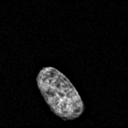
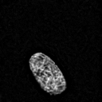

# Physics Informed Denoising Diffusion Probabilistic Model


This is the implementation of the PI-DDPM network using a basic UNet architecture as backbone.

## How to cite us

Li, R., Della Maggiora, G., Andriasyan, V., Petkidis, A., Yushkevich, A., Deshpande, N., ... & Yakimovich, A. (2024). Microscopy image reconstruction with physics-informed denoising diffusion probabilistic model. Communications Engineering, 3(1), 186.

```
@article{li2024microscopy,
  title={Microscopy image reconstruction with physics-informed denoising diffusion probabilistic model},
  author={Li, Rui and Della Maggiora, Gabriel and Andriasyan, Vardan and Petkidis, Anthony and Yushkevich, Artsemi and Deshpande, Nikita and Kudryashev, Mikhail and Yakimovich, Artur},
  journal={Communications Engineering},
  volume={3},
  number={1},
  pages={186},
  year={2024},
  publisher={Nature Publishing Group UK London}
}
```

## System Requirements


### Software Dependencies:
To prepare your environment please install dependencies using pip and the provided requirements.txt file:
```pip install -r requirements.txt```

## Installation Guide
Follow these instructions to install the project:
1. Clone the repository:
   ```bash
   git clone https://github.com/casus/pi-ddpm.git
2. Navigate to the project directory: 
   ```bash
   cd pi-ddpm
3. Run in your environment ```pip install -r requirements.txt```

## Training on simulated data:

To run the project demo with simulated data, follow these instructions:

1. Generate synthetic sample using the function `generate_synthetic_sample` with your desired parameters. Use the provided mode `metaballs` for simple figure generation without the need to download additional data for demo purposes.
2. Store the generated PSFs and ground truth images into npz files.
3. If you want to use your own data, you can only store the generated PSFs and the desired ground-truth data, the code will convolve the PSFs with your data and generate the simulated widefield/confocal images.
4. run ```python train_ddpm.py``` or ```python train_unet.py``` with paths to your generated datasets.


## How to Test

1. After training the model, run the `test_diffusion` script.
```bash
python test_diffusion.py
```
2.  You can change the regularization type and strength in the parameters of the function. 
3. The provided teaser file has some widefield samples and some confocal samples you can run the model on both to see the differences.
4. The output images will be saved in `./imgs_output/testing/reconstructions_confocal.npz` for the confocal teaser and `./imgs_output/testing/reconstructions_widefield.npz` for the widefield images. 
5. The inference should take 23.07s in a computer with i9-7900x cpu, and a RTX 3090 TI for each modality. 


## Results
After training the model you should see the following reconstructed images.
## Widefield




## Confocal


